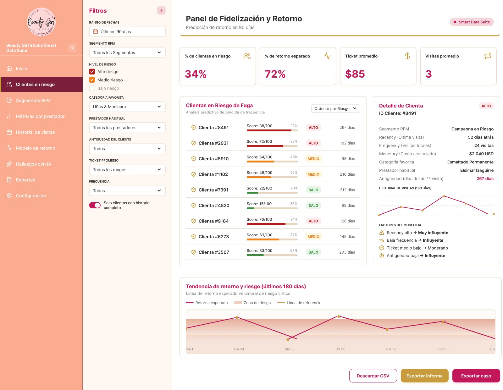

# Entrega 5 - Diseño del frontal y experiencia de usuario  

**Máster en Data Science & AI**  
**Tarea:** Entrega 5 - Diseño del frontal y experiencia de usuario del producto  
**Proyecto:** Beauty Girl Studio Smart Data Suite  
**Fecha de entrega:** 23 de Agosto de 2026  

---

# 1. Resumen de la solución y del usuario

El proyecto aborda un problema crítico del negocio: **identificar qué clientas están en riesgo de no volver** y **estimar su probabilidad de retorno en los próximos 90 días**, permitiendo a Beauty Girl Studio tomar decisiones de fidelización basadas en datos.

El frontal se diseña alineado con el contrato analítico definido en la Entrega 4:

- La salida principal del modelo es:  
  - `prob_retorno_90d` (probabilidad de retorno en 90 días).  
  - `prediccion` (retorna / no retorna).  
  - Variables de explicación (factores principales).

A partir de esta salida se construyen métricas de negocio:

- **Riesgo de no retorno**: derivado de `1 - prob_retorno_90d`.  
- **Score de riesgo**: escala de 0 a 100 donde 100 indica máximo riesgo de no retorno.  
- **Etiqueta de riesgo**: Bajo / Medio / Alto según umbrales del score.

## Usuario principal

La usuaria principal es **la propietaria del estudio**, quien gestiona citas, promociones y comunicación con las clientas. No es experta en analítica, por lo que necesita un frontal claro, simple y accionable.

## Necesidad del usuario

- Saber **qué clientas tienen mayor riesgo de no retorno**.  
- Priorizar acciones de fidelización (recordatorios, promociones, mensajes personalizados).  
- Comprender por qué una clienta aparece como de alto riesgo.  

## Tipo de producto

El producto diseñado es un **dashboard predictor y explorador de clientas**, que integra:

- Ranking de clientas ordenado por **riesgo de no retorno**.  
- Segmentación RFM.  
- Score de riesgo (0–100) coherente con el modelo.  
- Probabilidad de retorno en 90 días.  
- Antigüedad de la clienta.  
- Historial de visitas.  
- Factores principales del modelo.  
- Gráfico de tendencia de riesgo y retorno.  
- Filtros avanzados.

## Resultado principal que obtiene el usuario

- **Score de riesgo de no retorno** (0–100).  
- **Probabilidad de retorno en 90 días**.  
- **Etiqueta de riesgo (Bajo / Medio / Alto)**.  
- **Explicación de los factores que influyen en el riesgo**.  
- **Base para decidir qué acciones comerciales ejecutar**.

---

# 2. Imagen mockup del frontal

A continuación se integra el mockup principal del frontal.  
La imagen se encuentra en:

`assets/05_mockup_frontal.png`

Y se muestra embebida:

El mockup refleja:

- Un ranking con **una fila por clienta anonimizada**, sin IDs repetidos.  
- Columnas coherentes con la salida del modelo: `id_cliente_anon`, score de riesgo, probabilidad de retorno, días desde última visita, etiqueta de riesgo.  
- Un panel de detalle que muestra la información de una única clienta seleccionada.  

---

# 3. Justificación del diseño

El diseño del frontal se justifica desde tres perspectivas: utilidad, flujo de usuario y experiencia de usuario, estando explícitamente alineado con el contrato analítico del modelo.

---

## 3.1. Utilidad y valor de la solución

El frontal permite resolver la tarea más importante del negocio: **localizar clientas con alto riesgo de no retorno y actuar a tiempo**.

### Valor aportado

- Reduce el riesgo de abandono al identificar clientas prioritarias.  
- Ahorra tiempo al evitar revisar manualmente el historial de cada clienta.  
- Facilita decisiones basadas en datos, no solo en intuición.  
- Permite medir cuántas acciones comerciales útiles se generan a partir del ranking.

### Información esencial mostrada

En la pantalla principal se muestran:

- **Score de riesgo de no retorno (0–100)**: derivado de `1 - prob_retorno_90d`.  
- **Probabilidad de retorno en 90 días**.  
- **Etiqueta de riesgo (Bajo / Medio / Alto)**.  
- Segmento RFM.  
- Recency, Frequency, Monetary.  
- Antigüedad de la clienta.  
- Categoría favorita.  
- Prestador habitual (para análisis y decisiones, no como variable principal del modelo).  
- Historial de visitas.  
- Tendencia de riesgo y retorno.

### Información que se decidió no mostrar

- Datos personales (nombre, email, teléfono).  
- Información técnica del modelo.   
- Métricas técnicas internas avanzadas (AUC, F1, etc.) que no son necesarias para la propietaria.

### Conversión del análisis en acción

El frontal incluye botones para:

- Exportar informe.  
- Exportar caso.  
- Descargar CSV.

El panel de detalle muestra los factores principales del modelo (por ejemplo, recency alta, baja frecuencia, ticket medio bajo) para que la propietaria pueda decidir qué acción comercial tiene más sentido.

---

## 3.2. Flujo de usuario

El flujo principal está diseñado para que la propietaria obtenga valor en menos de 30 segundos, partiendo del riesgo de no retorno.

### 1. Punto de entrada

Al acceder al dashboard, la usuaria ve:

- KPIs principales del periodo (por ejemplo, % de clientas en alto riesgo, retorno esperado).  
- Filtros avanzados.  
- Ranking de clientas ordenado por **score de riesgo de no retorno** (de mayor a menor) por defecto.

### 2. Selecciones

Filtros disponibles:

- Rango de fechas de referencia.  
- Segmento RFM.  
- Nivel de riesgo (Bajo / Medio / Alto).  
- Categoría favorita.  
- Prestador habitual.  
- Antigüedad de la clienta.  
- Ticket promedio.  
- Frecuencia de visitas.  
- Opción para mostrar solo clientas con suficiente histórico.

### 3. Procesamiento

Cuando la usuaria ajusta filtros o selecciona una clienta:

- El sistema consulta el snapshot correspondiente en la capa gold.  
- Recupera `prob_retorno_90d` y calcula el **score de riesgo** = `(1 - prob_retorno_90d) * 100`.  
- Asigna la etiqueta de riesgo según umbrales definidos (por ejemplo, Alto ≥ 70, Medio 40–69, Bajo < 40).  
- Actualiza el panel de detalle y el gráfico inferior de tendencia.

### 4. Resultado

La usuaria recibe:

- Ranking ordenado por riesgo de no retorno.  
- Para cada clienta: score de riesgo, probabilidad de retorno, etiqueta de riesgo, días desde última visita, segmento RFM.  
- En el panel de detalle: RFM, antigüedad, categoría favorita, prestador habitual, historial de visitas, factores principales del modelo.  
- En el gráfico inferior: tendencia de retorno y riesgo en los últimos 180 días.

### 5. Acción

La usuaria puede:

- Exportar informe general del periodo.  
- Exportar el caso de una clienta concreta para seguimiento.  
- Descargar CSV para análisis adicional.  
- Priorizar clientas de alto riesgo para campañas o recordatorios.  

### 6. Excepciones

- Historial insuficiente → mensaje claro indicando que no se puede calcular un score fiable.  
- Predicción con baja estabilidad → etiqueta de “riesgo incierto” y aviso de interpretación cuidadosa.  
- Error técnico → mensaje comprensible y sin términos excesivamente técnicos.

---

## 3.3. Experiencia de usuario

El diseño se basa en principios de claridad, simplicidad y confianza, con una estética cálida y profesional.

### Jerarquía visual

- KPIs y resumen del periodo en la parte superior.  
- Ranking de clientas en el centro, con **una fila por clienta** y sin IDs repetidos.  
- Panel de detalle a la derecha, mostrando la información de la clienta seleccionada.  
- Gráfico inferior ocupando todo el ancho para visualizar la tendencia de riesgo y retorno.

### Simplicidad

- Solo se muestran variables relevantes para la decisión de fidelización.  
- Filtros agrupados y claramente etiquetados.  
- Paneles laterales colapsables para disponer de pantalla completa cuando se necesite.  
- Etiquetas claras: “Riesgo alto”, “Riesgo medio”, “Riesgo bajo”.

### Legibilidad y consistencia

- Paleta de colores cálidos y otoñales:  
  - Fucsia profundo como color insignia de la marca para elementos clave.  
  - Dorado suave para acentos y resaltados.  
  - Rosa pálido y cremas para fondos.  
  - Terracota claro para la navegación lateral.  
- Tipografía legible y consistente.  
- Iconos lineales minimalistas para navegación y acciones.

### Contexto y confianza

- El score de riesgo se explica como derivado de la probabilidad de retorno.  
- La confianza se comunica mediante la propia probabilidad y la calidad del histórico.  
- Los factores del modelo se presentan como motivos principales del riesgo (por ejemplo, recency alta, baja frecuencia, ticket medio bajo).

### Control del usuario

- Paneles colapsables.  
- Filtros avanzados.  
- Acciones manuales (exportar, revisar, priorizar).

### Feedback del sistema

- Indicador de carga al recalcular el ranking o los gráficos.  
- Alertas claras si faltan datos o el histórico es insuficiente.  
- Mensajes de confirmación al exportar informes o casos.

---

# 4. Presentación de resultados y explicabilidad

El frontal evita mostrar solo una cifra; cada predicción se acompaña de contexto y explicación coherente.

## Resultado principal

- **Score de riesgo de no retorno (0–100)**: derivado de `1 - prob_retorno_90d`.  
- **Probabilidad de retorno en 90 días**.  
- **Etiqueta de riesgo (Bajo / Medio / Alto)**.  
- **Segmento RFM**.

## Información adicional

- Recency (días desde la última visita).  
- Frequency (número total de visitas).  
- Monetary (gasto acumulado).  
- Antigüedad de la clienta.  
- Categoría favorita.  
- Prestador habitual.  
- Historial de visitas (gráfico).  
- Tendencia de retorno y riesgo en el tiempo.  
- Factores principales del modelo (por ejemplo, recency alta, baja frecuencia, ticket medio bajo).

## Evitar certezas

- Se explica que el score y la probabilidad son estimaciones basadas en datos históricos.  
- No se presenta una “confianza del modelo” adicional que no esté definida analíticamente.  
- Se incluyen limitaciones del modelo (por ejemplo, necesidad de suficiente histórico, cambios en el negocio).

## Vista de detalle

La pantalla principal muestra solo lo esencial para priorizar clientas.  
La vista de detalle incluye:

- Variables completas de la clienta seleccionada.  
- Gráfico de visitas y comportamiento temporal.  
- Factores del modelo que explican el riesgo.  

---

# IA generativa como capa de explicación (opcional)

El MVP **no incluye IA generativa**, pero se plantea como mejora futura.

Si se incorpora, su función será:

- Resumir el estado de la clienta en lenguaje natural.  
- Explicar la predicción y el riesgo de forma narrativa.  
- Sugerir acciones basadas en los datos y en los factores del modelo.

La IA generativa se apoyará siempre en resultados ya calculados y no sustituirá al modelo ni inventará causas.

---

# 5. Alcance del MVP

El MVP incluirá:

- Dashboard funcional en Streamlit.  
- Filtros avanzados.  
- KPIs principales del periodo.  
- Ranking de clientas ordenado por score de riesgo de no retorno.  
- Panel de detalle por clienta.  
- Gráfico inferior de tendencia de retorno y riesgo.  
- Exportación de informes y casos (CSV / PDF).

Elementos que serán solo mockup en esta fase:

- Acciones automatizadas (envío directo de campañas).  
- Panel de IA generativa.  
- Integración con WhatsApp o email.

Tecnologías previstas:

- Python.  
- Pandas.  
- Scikit-learn.  
- Streamlit.  
- Plotly.  

---
