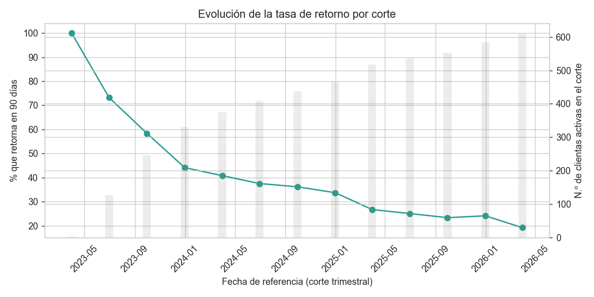
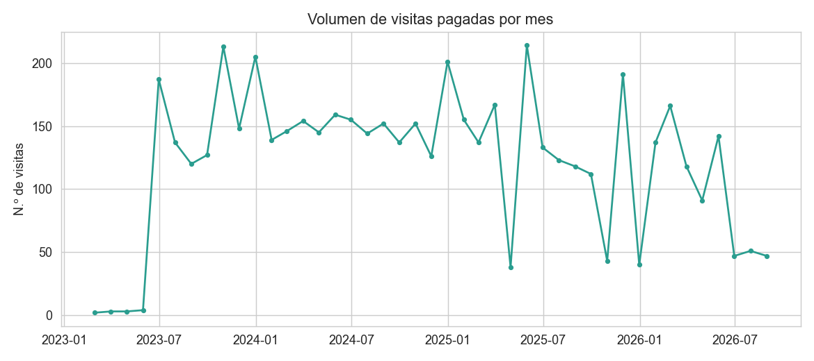
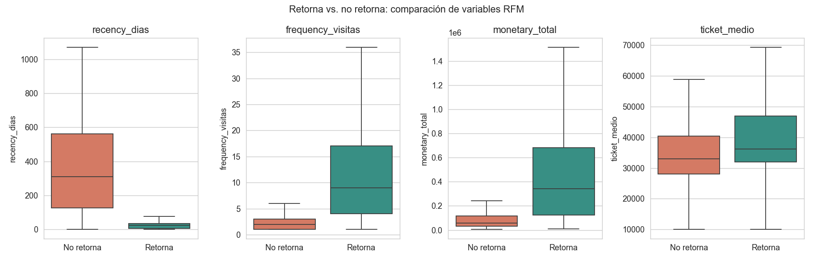
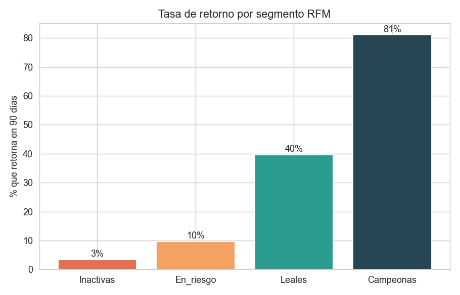
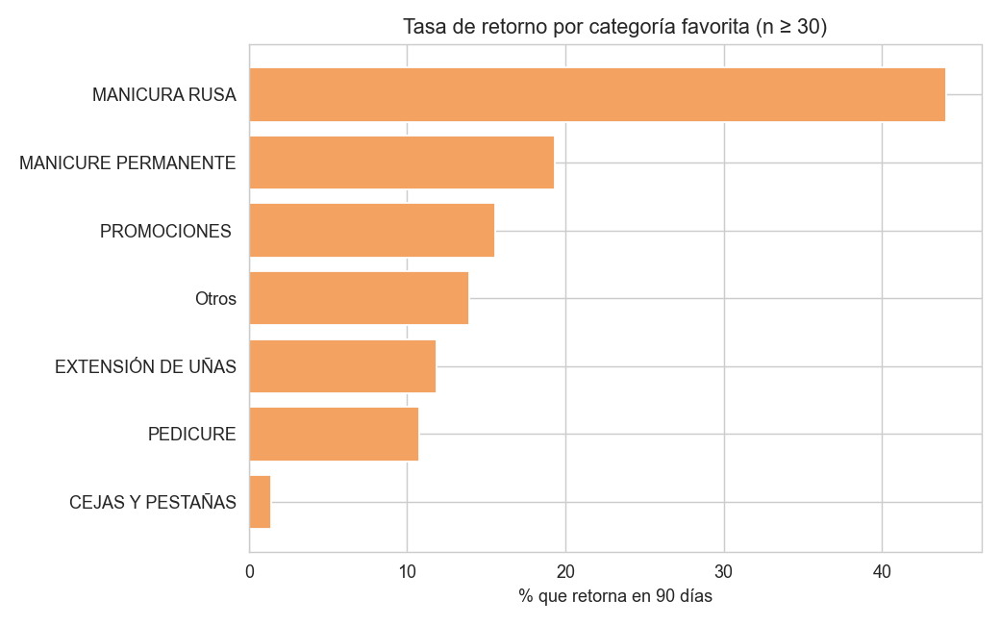
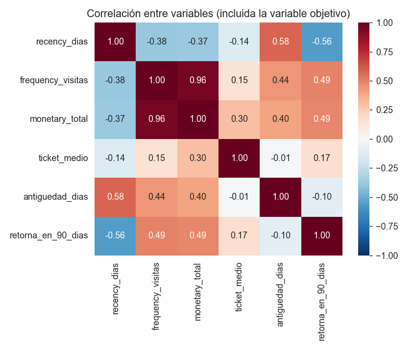
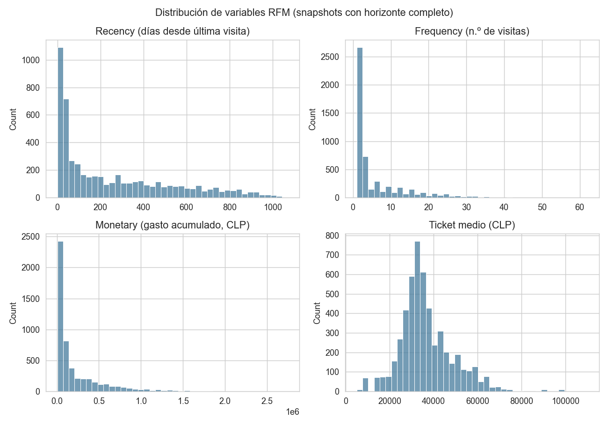

# Entrega 11 - EDA orientado a riesgo de no retorno

**Máster en Data Science & AI**
**Proyecto:** Beauty Girl Studio Smart Data Suite
**Paso del roadmap:** 7 de 13
**Rige bajo:** `docs/architecture/contrato_analitico.md`
**Código:** `src/eda/run_eda.py`
**Entrada:** `docs/entregas/10_capa_gold.md`

---

## 0. Objetivo y alcance

Analizar `gold_cliente_snapshot` y `gold_visitas` para responder las preguntas planteadas en `04_analisis_modelado.md` §2, comprobar las hipótesis allí formuladas y dejar documentadas las decisiones que este análisis obliga a tomar antes del modelado (paso 8).

**Todo el análisis que involucra la variable objetivo usa solo `horizonte_completo = True`** (5.192 de 6.434 snapshots, 610 clientas únicas) — nunca se compara nada contra filas que todavía no se pueden etiquetar.

Orientación (contrato analítico §2): las comparaciones se hacen "retorna" vs. "no retorna", pero las conclusiones se redactan en la dirección que le interesa al negocio — qué distingue a quien **no** va a volver.

---

## 1. Hallazgo principal y el más importante para el modelado: la tasa de retorno no es estable en el tiempo



```
fecha_referencia   n_clientas   % retorno
2023-03-31            3          100.0   <- ruido: solo 3 clientas, se descarta
2023-06-30           127           73.2
2023-09-30           245           58.4
2023-12-31           331           44.1
2024-03-31           375           40.8
2024-06-30           408           37.5
2024-09-30           437           36.2
2024-12-31           466           33.7
2025-03-31           517           26.7
2025-06-30           535           25.0
2025-09-30           553           23.3
2025-12-31           585           24.1
2026-03-31           610           19.2
```

El primer corte (3 clientas) se descarta por no ser representativo. Pero **incluso ignorándolo, la caída de 73% a 19% con bases de 127 a 610 clientas es demasiado grande y sostenida para explicarse solo por tamaño de muestra**. Es un patrón real: a medida que crece la base de clientas, la proporción que retorna en 90 días baja de forma consistente, corte tras corte.

**Implicación directa para el paso 8 (modelado):** el split temporal train/val/test ya estaba planeado en `04_analisis_modelado.md` (con margen de 90 días entre cortes) — este hallazgo confirma que **es imprescindible**, no solo una buena práctica. Un modelo entrenado sin tener en cuenta esta deriva podría aprender una tasa base de retorno que ya no corresponde a los datos más recientes. Además, la calibración del modelo (contrato analítico §6) deberá revisarse **por sub-periodo**, no solo de forma agregada sobre el test set completo — un modelo bien calibrado en promedio podría estar mal calibrado específicamente en los cortes más recientes, que son justo los que importan para producción.

### Un segundo hallazgo que puede estar conectado con el anterior



Los últimos tres meses con datos completos (junio, julio y agosto de 2026) muestran un volumen de visitas de **47-51 por mes**, frente a un rango histórico típico de **120-200**. No es un artefacto de mes incompleto (agosto tiene su última visita registrada el día 31, el último día del mes).

**No se puede determinar con los datos disponibles si esto es:** una caída real de la actividad del negocio, un efecto estacional (invierno en Chile), un cambio operativo (menos personal, cierre parcial), o un problema de captura de datos en el sistema de origen en ese periodo. **Se deja como alerta para validar directamente con la propietaria**, con el mismo criterio que la alerta de bisutería del profiling (`06_data_profiling.md` §6) — antes de asumir que la caída de la tasa de retorno de los últimos cortes (§1) es un patrón de comportamiento de clientas y no, al menos en parte, un reflejo de esta caída de actividad del negocio.

---

## 2. Las cuatro variables RFM separan con mucha fuerza a quien retorna de quien no



| Variable | Mediana — retorna | Mediana — no retorna | p-valor (Mann-Whitney) |
|---|---|---|---|
| `recency_dias` | 23 días | 310 días | ≈ 0 |
| `frequency_visitas` | 9 visitas | 2 visitas | 2.6 × 10⁻²⁹⁸ |
| `monetary_total` | $343.000 | $58.000 | 3.5 × 10⁻³⁰⁰ |
| `ticket_medio` | $36.167 | $33.000 | 4.8 × 10⁻⁴⁷ |

Las tres hipótesis principales de `04_analisis_modelado.md` §2 quedan confirmadas con una diferencia muy grande y estadísticamente significativa: recency baja, frecuencia alta y gasto acumulado alto se asocian claramente con mayor probabilidad de retorno. `ticket_medio` también separa los grupos, aunque con una diferencia de mediana mucho más pequeña (~$3.000) — es la variable RFM más débil de las cuatro.

---

## 3. `segmento_rfm` (el heurístico del paso 6) queda validado con una monotonía casi perfecta



```
Inactivas:    3%
En_riesgo:   10%
Leales:      39%
Campeonas:   81%
```

El heurístico transversal por cuartiles definido en `10_capa_gold.md` §2.2 produce una relación monótona y con saltos grandes entre segmentos — no hace falta rediseñarlo antes de pasar al modelado. Se mantiene como está.

---

## 4. Categoría favorita: MANICURA RUSA es, con diferencia, el motor de fidelización del negocio



```
MANICURA RUSA:          44.3%  (n=3.197 — el 62% de la base de clientas etiquetables)
MANICURE PERMANENTE:    19.3%  (n=429)
Otros:                   13.5%  (n=208)
EXTENSIÓN DE UÑAS:       11.7%  (n=599)
PROMOCIONES:             10.9%  (n=129)
PEDICURE:                10.5%  (n=475)
CEJAS Y PESTAÑAS:         2.1%  (n=146)
```

MANICURA RUSA no solo es la categoría más popular (consistente con el profiling: 4.094 de 6.559 ítems), sino la que más fideliza por un margen amplio. CEJAS Y PESTAÑAS tiene una tasa de retorno muy baja — coherente con ser un servicio más puntual/estacional que uno recurrente cada pocas semanas, pero vale la pena que la propietaria lo confirme: podría ser una categoría con margen para una acción de fidelización específica.

---

## 5. Alerta de diseño para el modelado: colinealidad alta entre `frequency_visitas` y `monetary_total`



```
correlación(frequency_visitas, monetary_total) = 0.96
```

Es esperable (quien visita más, gasta más en total), pero una correlación tan alta entre dos variables de entrada puede hacer inestables los coeficientes de la regresión logística (Modelo candidato 1 de `04_analisis_modelado.md` §3) sin que eso implique que el modelo prediga peor. **Recomendación para el paso 8:** reportar también el modelo con una de las dos variables retirada (o con una versión combinada, ej. `ticket_medio` ya cumple parcialmente ese rol) como parte de la comparación de alternativas y no interpretar el signo/magnitud de los coeficientes de `frequency_visitas` y `monetary_total` por separado sin tener esto en cuenta. Para Random Forest / Gradient Boosting la colinealidad es mucho menos problemática (no es necesario excluir nada ahí).

El resto de correlaciones son moderadas y en la dirección esperada: `recency_dias` es la variable individual más correlacionada con la variable objetivo (-0.56), seguida de `frequency_visitas` y `monetary_total` (0.49 cada una).

---

## 6. Verificación de calidad heredada del paso 4: ¿el 9.6% de identidades ambiguas distorsiona el análisis?

```
                                  n     tasa_retorno   recency_media   frequency_media   monetary_media
identidad_ambigua_transaccional
No (0)                          4.755      31.6%          260.4              5.9            232.070
Sí (1)                            437      37.5%          243.6              7.4            259.192
```

Las clientas con identidad ambigua (nombres que no se pudieron desambiguar entre ventas/items, ver `08_limpieza_normalizacion.md` §3.3) tienen una tasa de retorno **ligeramente más alta** y son algo más frecuentes/de mayor gasto que el resto — no una diferencia dramática, pero tampoco despreciable. Es coherente con la hipótesis ya anotada en la Entrega 07: clientas más activas tienen más probabilidad de aparecer varias veces en `clientes.xlsx` con datos de contacto ligeramente distintos.

**No se excluyen del modelado** (9.6% es demasiado volumen para descartar sin una razón de peso), pero se deja documentado que el modelo se entrenará con una pequeña porción de identidades que, en el peor caso, mezclan el historial de dos clientas reales distintas. Si en la validación del modelo (paso 9) el rendimiento resulta sensible a este grupo, aquí está la referencia para investigarlo.

---

## 7. Distribuciones RFM: todas con cola larga, como es típico en este tipo de negocio



`recency_dias`, `frequency_visitas` y `monetary_total` están fuertemente sesgadas a la derecha (muchas clientas con valores bajos, pocas con valores muy altos) — no es un problema de calidad de datos, es la forma esperada de este tipo de variables. `ticket_medio` es la única con forma aproximadamente simétrica, centrada entre $30.000 y $40.000. Esto es relevante para el paso 8: modelos basados en árboles (Random Forest, Gradient Boosting) no necesitan transformación; si se prueba regresión logística con regularización fuerte, podría valorarse una transformación logarítmica de `frequency_visitas` y `monetary_total`.

---

## 8. Resumen de decisiones que este EDA deja tomadas para el paso 8

1. **Split temporal train/val/test es obligatorio, no opcional** — la deriva de la tasa base de retorno (§1) lo confirma con datos, no solo por buena práctica metodológica.
2. **Evaluar calibración por sub-periodo**, no solo de forma agregada sobre el test set.
3. **Reportar un modelo de regresión logística con y sin `monetary_total`** (o `frequency_visitas`) dada la colinealidad de 0.96 (§5).
4. **`segmento_rfm` se mantiene sin cambios** (§3) — el heurístico transversal ya funciona.
5. **Dos alertas para validar con la propietaria antes de cerrar conclusiones de negocio** (no bloquean el modelado, pero si se explican, cambiarían la interpretación): la caída sostenida de visitas en jun-ago 2026 (§1) y la posibilidad de una acción de fidelización específica para CEJAS Y PESTAÑAS (§4).

---

## 9. Próximo paso

Con el EDA cerrado, el siguiente paso del roadmap es el **paso 8 — feature engineering**, seguido del **paso 9 — modelado** (baseline trivial, baseline RFM, regresión logística y Random Forest, con el split temporal y las consideraciones de calibración ya confirmadas aquí).