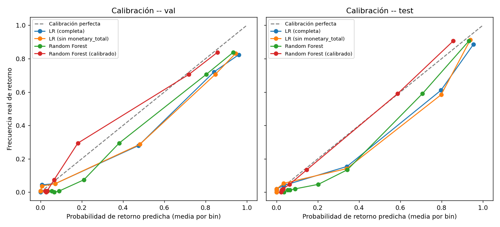
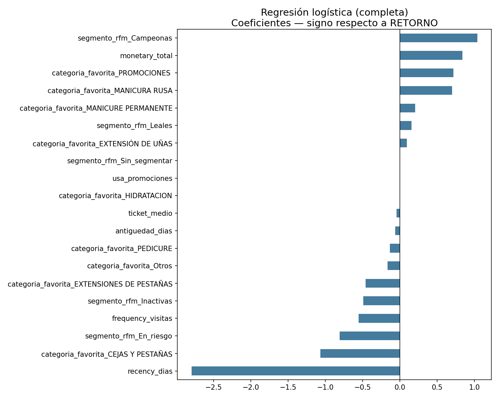
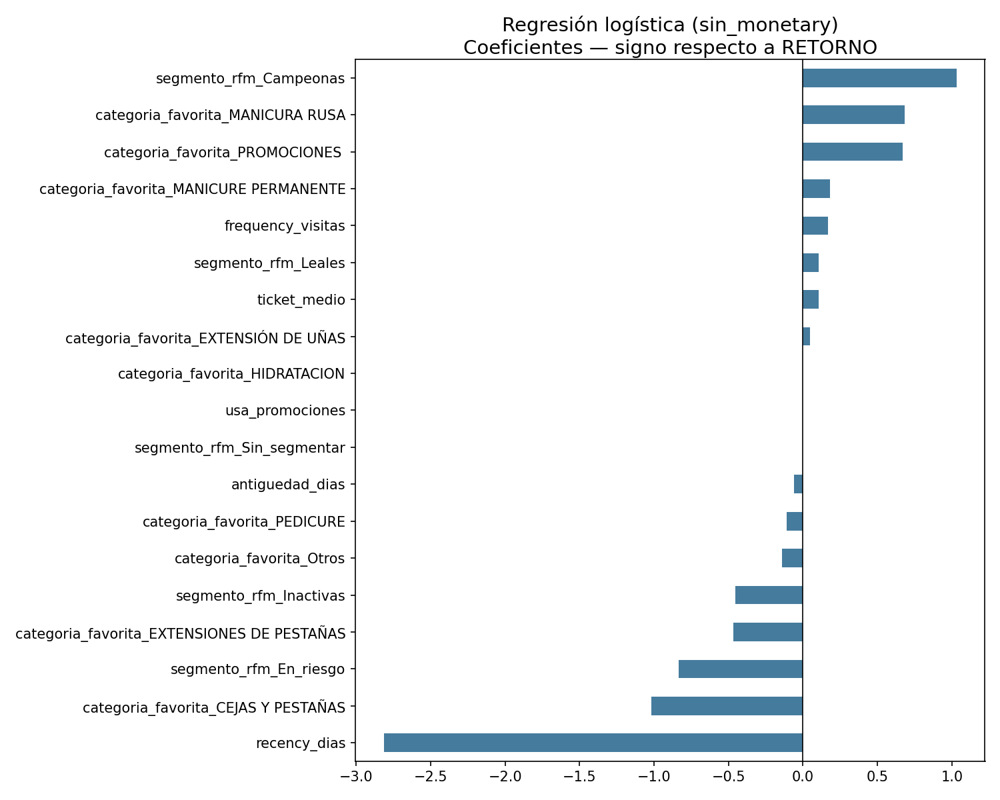
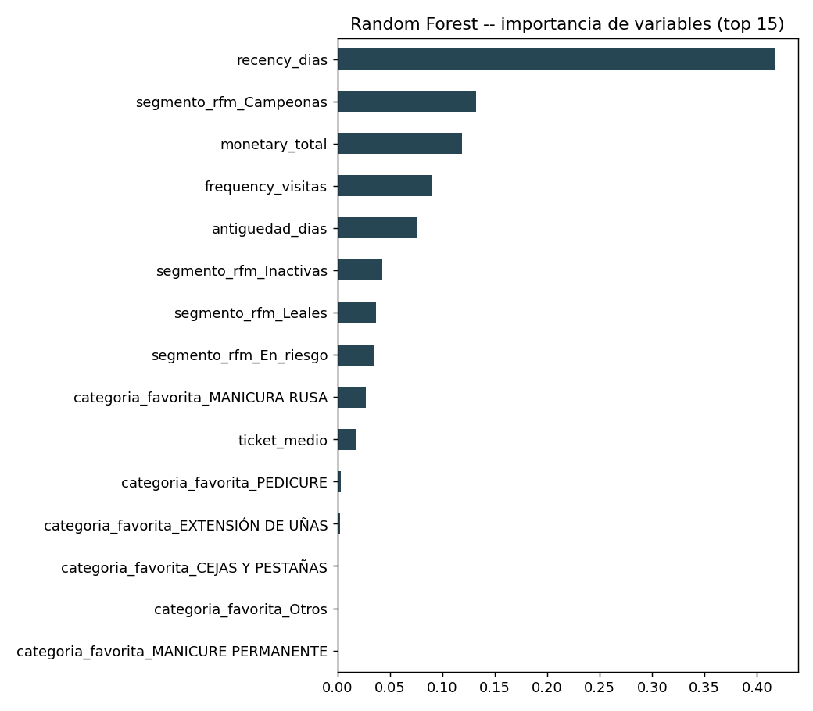

# Entrega 13 - Modelado

**Máster en Data Science & AI**
**Proyecto:** Beauty Girl Studio Smart Data Suite
**Paso del roadmap:** 9 de 13
**Rige bajo:** `docs/architecture/contrato_analitico.md`
**Código:** `src/model/train_model.py`
**Entrada:** `docs/entregas/12_feature_engineering.md`

---

## 0. Objetivo

Entrenar y comparar los dos baselines y los modelos candidatos definidos en `04_analisis_modelado.md`, evaluando siempre sobre la clase **"no retorna"** (contrato §2 y §6), con el umbral de decisión ajustado en validación (nunca 0.5 por defecto) y verificando calibración por separado en val y test dada la deriva temporal confirmada en el EDA.

> **Nota de actualización (v3):** esta entrega pasó por dos correcciones posteriores a la versión original, ambas documentadas con su verificación:
> 1. La calibración de Random Forest se cambió de `isotonic` a `sigmoid` (detectado en el paso 10: isotónica colapsaba `score_riesgo` a 14 valores distintos).
> 2. La función que elige el umbral de decisión (`elegir_umbral_optimo`) se corrigió por inestabilidad entre entornos (§6) -- el motivo inmediato de esta regeneración del documento.
>
> Los números de esta versión son los definitivos.

---

## 1. Tabla comparativa completa

| Modelo | Split | F1 (no retorna) | Recall (no retorna) | Precision (no retorna) | ROC-AUC | Brier |
|---|---|---|---|---|---|---|
| Baseline trivial | val | 0.863 | 1.000 | 0.758 | — | — |
| Baseline trivial | test | 0.879 | 1.000 | 0.784 | — | — |
| Baseline RFM | val | 0.915 | 0.926 | 0.904 | — | — |
| Baseline RFM | test | 0.931 | 0.937 | 0.924 | — | — |
| Regresión logística (completa) | val | 0.929 | 0.925 | 0.934 | 0.939 | 0.088 |
| Regresión logística (completa) | test | 0.944 | 0.945 | 0.943 | 0.953 | 0.077 |
| Regresión logística (sin `monetary_total`) | val | 0.927 | 0.919 | 0.936 | 0.937 | 0.088 |
| Regresión logística (sin `monetary_total`) | test | 0.945 | 0.943 | 0.947 | 0.955 | 0.076 |
| Random Forest | val | 0.930 | 0.927 | 0.932 | 0.941 | 0.086 |
| Random Forest | test | 0.945 | 0.951 | 0.940 | 0.952 | 0.075 |
| **Random Forest (calibrado)** | val | 0.929 | 0.926 | 0.932 | 0.941 | **0.081** |
| **Random Forest (calibrado)** | test | 0.946 | 0.951 | 0.942 | 0.952 | **0.065** |

**Precision@20%** (de las clientas con mayor score de riesgo, qué proporción realmente no retornó) — no depende del umbral de decisión, solo del orden:

```
LR (completa):              val 0.995  |  test 1.000
LR (sin monetary_total):    val 0.995  |  test 1.000
Random Forest:               val 0.991  |  test 0.996
Random Forest (calibrado):   val 0.991  |  test 0.996
```

---

## 2. Cómo leer el baseline trivial: por qué su F1 no es bajo (y por qué eso no lo hace útil)

`04_analisis_modelado.md` §3 advertía que el baseline trivial ("todas no retornan") tendría F1 = 0 si se evaluara sobre la clase "retorna". Aquí pasa lo contrario; y por una razón simétrica que conviene dejar explícita: como evaluamos sobre **"no retorna"** y esa es la clase **mayoritaria** del dataset (75-78%, según el split), el baseline trivial obtiene F1 = 0.86-0.88 solo por predecir siempre la clase más común — no por tener ninguna capacidad real de distinguir una clienta de otra.

**Esto es exactamente lo que revela ROC-AUC y Precision@20%, y el baseline trivial no puede calcularlos** (no produce ninguna probabilidad, por eso aparecen como `—` en la tabla): al predecir lo mismo para todo el mundo, no tiene forma de ordenar a las clientas por riesgo, que es el uso real que le va a dar la propietaria al ranking del dashboard.

Con esa lectura, los cuatro modelos candidatos sí superan claramente a ambos baselines donde importa: ROC-AUC 0.94-0.96 (vs. indefinido) y Precision@20% de 0.99-1.00 (vs. indefinido). El baseline RFM, aunque no calcula probabilidades, sí mejora notablemente al trivial en F1/recall/precision — confirma que la regla de negocio (recency ≤ 45 y frequency ≥ 1) captura señal real, tal como esperaba `04_analisis_modelado.md`.

---

## 3. Calibración: separada por split, como exigía el EDA



En **val**, los cuatro modelos siguen razonablemente la diagonal de calibración perfecta. En **test**, los modelos sin calibrar (LR completa, LR sin monetary, RF crudo) muestran sobreconfianza en el tramo de probabilidad alta (≈0.8 predicho vs. ≈0.6 real). **Random Forest (calibrado)** se mantiene más cerca de la diagonal en ese mismo tramo y tiene el Brier score más bajo en ambos splits (0.081 en val, 0.065 en test) — la calibración es una propiedad de las probabilidades predichas, no del umbral de decisión, así que esta sección no se vio afectada por la corrección del §6.

Esto confirma, con datos y no solo por precaución metodológica, la decisión ya tomada en el contrato analítico (§6): **las probabilidades no se muestran en el frontal sin pasar por calibración**.

---

## 4. Colinealidad `frequency_visitas` / `monetary_total`: confirmado el efecto que anticipó el EDA



En la regresión logística **con todas las variables**, `frequency_visitas` sale con coeficiente **negativo** — contradice directamente la correlación positiva (0.49) que el EDA (`11_eda.md` §5) ya había medido entre `frequency_visitas` y `retorna_en_90_dias`. Es el síntoma exacto de la colinealidad de 0.96 con `monetary_total` anticipada en el EDA.



Al retirar `monetary_total`, `frequency_visitas` recupera un coeficiente **positivo**, coherente con el resto del análisis. **Conclusión práctica:** si en el futuro se usa la regresión logística para explicar el riesgo de una clienta concreta en el frontal, debe usarse la versión **sin `monetary_total`**.

En ambas versiones, `recency_dias` domina con un coeficiente muy superior a cualquier otra variable — consistente con ser la variable más correlacionada con la variable objetivo en el EDA (-0.56) y la más importante en Random Forest (ver gráfico siguiente). *(Esta sección describe los coeficientes ajustados del modelo, que no dependen del umbral de decisión — sin cambios respecto a la versión anterior de este documento.)*



---

## 5. Decisión final, según los criterios del contrato analítico §6

| Criterio | Evaluación |
|---|---|
| Supera ambos baselines | ✅ Los 4 candidatos superan a los 2 baselines en ROC-AUC y Precision@20% |
| Estable en validación temporal | ✅ Ningún modelo empeora de val a test pese a la deriva de tasa base ya documentada |
| Razonablemente calibrado | ✅ Random Forest (calibrado) es el que mejor se mantiene cerca de la diagonal en el tramo de probabilidad alta en test |
| Interpretable / explicable | Regresión logística (sin `monetary_total`) es la más directa de explicar; Random Forest usa SHAP (ver paso 11) |
| Sin fuga de información temporal | ✅ Verificado en el paso 6 y heredado sin cambios |
| Permite ordenar por riesgo de forma útil | ✅ Los 4 candidatos con Precision@20% ≥ 0.99 |

**Modelo seleccionado para el MVP: Random Forest (calibrado).** Sigue siendo la elección correcta tras la corrección del §6 — ROC-AUC, Brier y Precision@20% (los criterios que realmente definieron la decisión) no cambiaron; solo se movió el punto de corte de clasificación dentro de una meseta donde el F1 era casi idéntico.

**Alternativa documentada:** regresión logística sin `monetary_total`, con rendimiento prácticamente equivalente (ROC-AUC 0.955 en test) y coeficientes explicables en una frase por variable.

---

## 6. Umbral de decisión: corrección por inestabilidad entre entornos

### El problema

Al ejecutar `train_model.py` en un entorno distinto (misma versión de scikit-learn, 1.5.0, pero diferente máquina), el umbral elegido para Random Forest (calibrado) cambió de 0.25 a 0.55 — una diferencia demasiado grande para ser una simple variación aceptable.

**Diagnóstico:** se calculó el F1 de la clase "no retorna" en toda la grilla de candidatos y se encontró una **meseta ancha y prácticamente plana entre 0.25 y 0.65** (variación de F1 menor a 0.002 en todo ese rango). Diferencias de punto flotante minúsculas entre entornos (BLAS, versión exacta de dependencias) bastan para que el `argmax` sobre esa meseta "salte" de un extremo a otro, aunque el modelo subyacente sea, en la práctica, el mismo.

### La corrección

`elegir_umbral_optimo` ya no toma el único punto máximo de una grilla fija de 19 candidatos. Ahora:

1. Evalúa F1 sobre una grilla fina (valores únicos de probabilidad predicha en validación, hasta 200 puntos).
2. Identifica la **meseta** de candidatos cuyo F1 está a menos de 0.005 del máximo observado.
3. Toma la **mediana** de esa meseta como umbral final — un punto estable, no un extremo sensible al ruido numérico.

**Validación de la corrección:** se simularon 20 perturbaciones numéricas minúsculas (ruido gaussiano de desviación 0.0001 sobre las probabilidades) para imitar la diferencia entre entornos. Con el método anterior, el umbral podía saltar entre 0.25 y 0.75 (todo el ancho de la meseta). Con el método corregido, el rango se redujo a **0.45-0.53** (desviación estándar 0.017) — mucho más estable, aunque no perfectamente invariante (la pertenencia exacta a la meseta puede moverse levemente).

### Umbrales definitivos (con el método corregido)

```
Random Forest (calibrado):                 umbral = 0.52
Regresión logística (sin monetary_total):  umbral = 0.73
```

### Qué SÍ cambia y qué NO cambia por esta corrección

| Depende de `umbral_decision` (cambia) | Depende solo del score continuo (NO cambia) |
|---|---|
| Matriz de confusión (paso 10) | Umbrales de `banda_riesgo` (92.6 / 97.3) |
| Lista de "peores errores" (paso 10) | Tabla de deciles y evidencia de bandas (paso 10) |
| Rendimiento por segmento RFM -- valores exactos (paso 10) | Distribución de bandas en producción (paso 11) |
| Columna `prediccion` en `scoring_actual.parquet` (paso 11) | `score_riesgo`, `prob_retorno_90d`, ranking del dashboard |

El paso 10 se regeneró completo con los nuevos valores (`docs/entregas/14_validacion_y_umbrales.md`). El dashboard (paso 11) no requiere cambios visuales: no muestra la columna `prediccion` en ningún sitio de la interfaz, solo `banda_riesgo` y `prob_retorno_90d`, ninguno de los dos afectado.

---

## 7. Próximo paso

Con el modelo seleccionado y el umbral de decisión ya estabilizado, el siguiente paso del roadmap es la **validación y análisis de errores** (paso 10) -- regenerado con estos valores definitivos en `14_validacion_y_umbrales.md`.