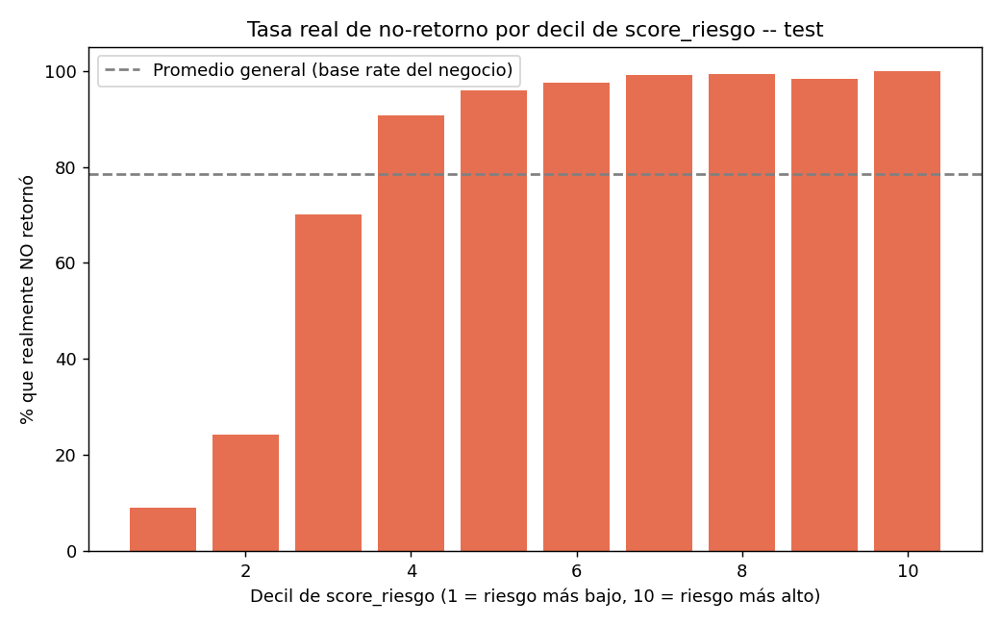
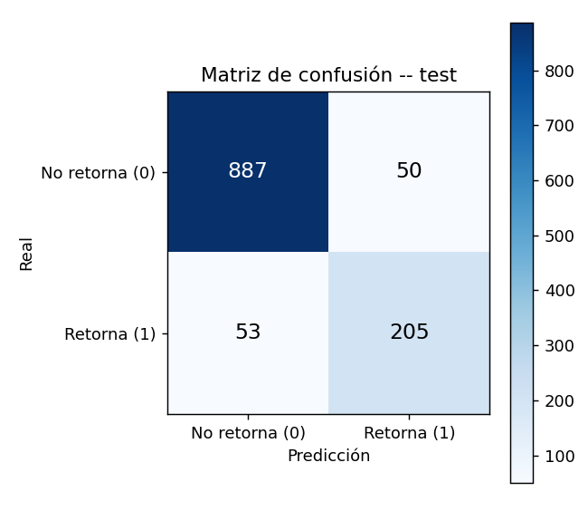

# Entrega 14 - Validación, análisis de errores y umbrales definitivos de riesgo

**Máster en Data Science & AI**
**Proyecto:** Beauty Girl Studio Smart Data Suite
**Paso del roadmap:** 10 de 13
**Rige bajo:** `docs/architecture/contrato_analitico.md`
**Código:** `src/model/evaluar_modelo.py` (reutiliza `src/model/train_model.py`)
**Entrada:** `docs/entregas/13_modelado.md`

---

## 0. Objetivo

Analizar en detalle los errores del modelo seleccionado (Random Forest calibrado) sobre test, revisar su rendimiento por segmento y categoría y fijar los umbrales **definitivos** de `banda_riesgo` que hoy son provisionales (40/70) en el contrato analítico §7 — con la distribución real de `score_riesgo` y una lectura de coste/beneficio, tal como exige el contrato.

---

## 1. Corrección aplicada antes de poder fijar umbrales: isotonic → sigmoid

> **Nota de actualización:** además de esta corrección, el umbral de decisión (`umbral_decision`) se recalculó tras estabilizar `elegir_umbral_optimo` (ver `13_modelado.md` §6: la selección anterior era sensible a diferencias de punto flotante entre entornos). Esto cambió la matriz de confusión y el detalle de errores de este documento (§3-4), pero **no** los umbrales de `banda_riesgo` (§2) ni la distribución de producción (§5), que dependen solo del score continuo, no del umbral de decisión. Los números de este documento ya son los definitivos con ambas correcciones aplicadas.

Al intentar construir las bandas por decil de `score_riesgo`, apareció un problema: la calibración isotónica elegida en el paso 9 solo produce **14 valores distintos** de `score_riesgo` en las 1.195 filas de test y uno solo de esos valores (99.47) lo comparten **430 clientas (36% del test)** — imposible priorizar dentro de un grupo así de grande y empatado.

Se probó la alternativa de calibración por **sigmoide (Platt scaling)**: produce **900 valores distintos** (prácticamente continuo) y, además, un Brier score ligeramente **mejor** (0.0655 vs. 0.0676 con isotónica) — no es un trade-off, es una mejora en ambos frentes. Se cambió `method="isotonic"` por `method="sigmoid"` en `train_model.py` y se repropagó: la tabla comparativa del paso 9 se actualizó (Random Forest calibrado pasa de Brier 0.068 a **0.065** en test) y el resto de candidatos no se vieron afectados.

**Por qué isotónica colapsaba tanto aquí:** con un set de calibración de 1.088 filas (val) y un modelo de árboles cuyas probabilidades ya tienden a agruparse en un número limitado de valores, el ajuste no paramétrico de isotónica (una función escalón) termina con pocos escalones. Sigmoide, al ajustar una función logística continua de 2 parámetros, no tiene ese problema incluso con un set de calibración modesto.

---

## 2. Umbrales de `banda_riesgo`: por qué un corte por tasa absoluta no funciona en este negocio

El primer intento fue definir "Alto" como los deciles donde la tasa real de no-retorno supera el 80%. Con eso, el **75% de las clientas de producción** caían en "Alto riesgo" (467 de 623) — inútil para priorizar, es casi todo el mundo.

**Causa:** la tasa base de no-retorno de este negocio ya es del **78.4%** en test (coherente con la deriva documentada en el EDA, `11_eda.md` §1). Cualquier corte por tasa absoluta por encima de ese 78% captura, casi por definición, a la mayoría de las clientas — el modelo no está fallando, es que el punto de referencia (80%) está mal elegido para una base tan desequilibrada.

**Corrección:** los umbrales se fijan por **percentil de `score_riesgo`** (la distribución real que pide el contrato §7), dimensionando las bandas a un volumen que la propietaria pueda trabajar, no a una tasa de acierto:

- **Alto** = 25% de clientas con mayor `score_riesgo`
- **Bajo** = 35% de clientas con menor `score_riesgo`
- **Medio** = el 40% restante

La tasa real de no-retorno dentro de cada banda se calcula **después**, como evidencia de calidad — no como la regla que define la banda.



El gráfico muestra por qué el 75%/35% tiene sentido: la diferenciación real ocurre en los deciles 1-3 (9% → 23% → 73% de no-retorno); a partir del decil 4 la curva se aplana cerca del 90-100%. Ahí es donde conviene poner el corte de "Bajo" (entre los deciles 2 y 3), no en la mitad de la meseta superior.

### Umbrales definitivos (test)

```
Bajo:  score_riesgo <= 92.6
Alto:  score_riesgo >= 97.3
```

Reemplazan los provisionales 40/70 del contrato analítico §7 — **la escala es distinta a la del mockup original** porque `score_riesgo` de este modelo se concentra en el tramo alto (base rate de no-retorno ya alto); esto se documenta explícitamente para que quien lea el dashboard no compare estos números contra la intuición de una escala 0-100 uniforme.

### Evidencia de calidad de las bandas resultantes

| Banda | n (test) | % real que no retornó |
|---|---|---|
| Bajo | 418 | 42.3% |
| Medio | 478 | 96.7% |
| Alto | 299 | 99.7% |

**Nota honesta para la propietaria:** incluso la banda "Bajo" tiene un 42.3% de no-retorno real — "Bajo riesgo" aquí significa *menos riesgo que el resto de la base*, no "riesgo bajo en términos absolutos". Es un reflejo directo de la deriva ya documentada en el EDA: la tasa de retorno del negocio ha bajado con el tiempo y las bandas no pueden inventar seguridad donde los datos no la muestran. Esto es una conclusión que vale la pena discutir con la propietaria.

### Distribución resultante en el snapshot de producción actual (2026-08-31)

```
Alto:  162 clientas (26%)
Medio: 277 clientas (44%)
Bajo:  184 clientas (30%)
```

Un reparto mucho más manejable para priorizar acciones comerciales que el 75%/17%/8% del primer intento.

---

## 3. Matriz de confusión y análisis de errores (test)



```
                Predicción: No retorna   Predicción: Retorna
Real: No retorna         887                      50
Real: Retorna              53                     205
```

- **50 falsos negativos de negocio** (clientas que realmente no volvieron, pero el modelo predijo que sí) — el error que más le cuesta a la propietaria, porque son clientas en riesgo real que el sistema no habría señalado.
- **53 falsos positivos** (predijo que no volvería, pero sí volvió) — coste menor: en el peor caso, una acción de fidelización de más para alguien que no la necesitaba.

### Los 15 peores errores: patrón encontrado

Se revisaron los casos de mayor riesgo de negocio (no retornaron de verdad, con el `score_riesgo` más bajo entre los que el modelo se equivocó). Todos comparten un patrón: **recency baja (0-57 días) y frequency moderada-alta (9-40 visitas)** — es decir, clientas que por su comportamiento histórico se veían claramente fieles y activas, pero dejaron de volver de forma inesperada.

**Esto no es un fallo corregible ajustando el modelo**: RFM captura comportamiento pasado, no eventos externos (mudanza, cambio de trabajo, insatisfacción puntual, cambio a la competencia) que no están en ningún dataset disponible. Se documenta como limitación estructural del enfoque, no como algo a resolver en una próxima iteración de features — vale la pena que quede explícito.

---

## 4. Rendimiento por segmento RFM (test)

| Segmento | n | % real no retorna | Recall (no retorna) | Precision (no retorna) |
|---|---|---|---|---|
| Inactivas | 219 | 99.5% | 100.0% | 99.5% |
| En_riesgo | 431 | 97.4% | 99.8% | 97.4% |
| Leales | 275 | 80.7% | 90.1% | 91.3% |
| Campeonas | 270 | 28.5% | 70.1% | 69.2% |

El modelo es casi perfecto en los segmentos de mayor riesgo (Inactivas, En_riesgo) — que son, no por casualidad, los que más le importan al negocio. Es notablemente más débil en **Campeonas** (recall 70.1%: de las "campeonas" que sí dejaron de volver, el modelo detecta el 70%, mejor que antes de la corrección del umbral, pero sigue siendo el segmento más débil). Es coherente con el hallazgo de la sección 3: las clientas más fieles son precisamente las que, cuando dejan de volver, lo hacen de forma menos predecible a partir del historial RFM.

---

## 5. Vista previa de producción: el pipeline funciona de extremo a extremo

Se aplicó el modelo ya entrenado al snapshot más reciente (`fecha_referencia = 2026-08-31`, sin horizonte completo, el que usará el dashboard). Ejemplo de las 10 clientas de mayor riesgo:

```
score_riesgo ≈ 97.7-97.8, banda_riesgo = Alto, prob_retorno_90d ≈ 0.022-0.023
```

Sirve como confirmación de que `gold_cliente_snapshot` → `model_input` → modelo → `score_riesgo`/`banda_riesgo` funciona sin intervención manual — es literalmente lo que el dashboard va a mostrar en el paso 11.

---

## 6. Próximo paso

Con el modelo validado, los errores caracterizados y los umbrales de `banda_riesgo` fijados con datos reales, el siguiente paso del roadmap es conectar todo esto al **frontal (dashboard en Streamlit)** — implementando el mockup ya validado en la Entrega 5, ahora con `score_riesgo`, `banda_riesgo` y `explicacion` (factores del modelo) alimentados por el pipeline real en lugar de datos de ejemplo.