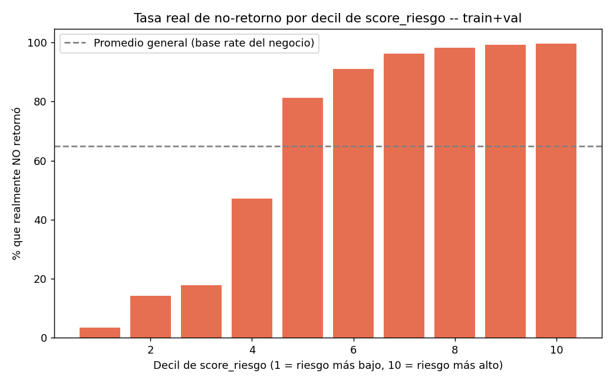
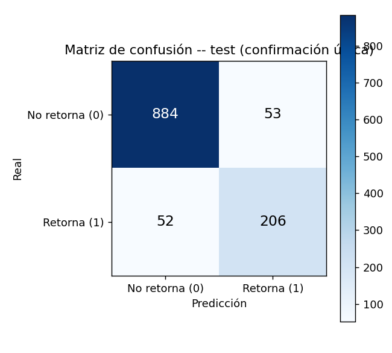

# Entrega 14 - Validación, análisis de errores y umbrales definitivos de riesgo

**Máster en Data Science & AI**
**Proyecto:** Beauty Girl Studio Smart Data Suite
**Paso del roadmap:** 10 de 13
**Rige bajo:** `docs/architecture/contrato_analitico.md`
**Código:** `src/model/evaluar_modelo.py` (reutiliza `src/model/train_model.py`)
**Entrada:** `docs/entregas/13_modelado.md`

> **Corrección post-feedback del tutor (Entrega 4), aplicada íntegramente en esta versión:**
> la versión anterior de este documento elegía el método de calibración y fijaba los umbrales
> de `banda_riesgo` mirando el conjunto de **test**, lo que dejaba de ser una evaluación
> independiente. Esta versión rehace ambas decisiones usando **solo train/validación** y
> reserva test para una **única confirmación final**, sin retroalimentar nada. Todos los
> números de este documento están sincronizados con `models/model_meta.json` tal como se
> generó al ejecutar `persistir_modelo.py` por última vez — es la única fuente de verdad;
> ningún valor aquí se transcribió a mano.

---

## 0. Objetivo

Fijar el método de calibración y los umbrales **definitivos** de `banda_riesgo` —hoy
provisionales (40/70) en el contrato analítico §7— usando exclusivamente train y
validación y confirmar una sola vez sobre test que el resultado se sostiene con datos
nunca usados para decidir nada. Esta es la regla de oro de todo el documento (ver también
`src/model/evaluar_modelo.py`, que la aplica función por función).

---

## 1. Método de calibración: sigmoid, elegido solo con validación

**Corrección de metodología:** la versión anterior de este documento justificaba la
elección de "sigmoid" sobre "isotonic" comparando el Brier score de ambas **en test**
(0.068 vs 0.066). Eso es exactamente el tipo de decisión que el conjunto de test no puede
influir sin dejar de ser independiente. La comparación se rehizo usando **solo el conjunto
de validación**:

| Método | Brier (val) | Valores distintos de score_riesgo (val) |
|---|---|---|
| sigmoid | 0.0812 | 610 |
| isotonic | 0.0753 | **15** |

Isotonic da mejor Brier en val, pero colapsa el score a solo 18 valores distintos —
inservible para ordenar un ranking de cientos de clientas dentro de una misma banda de
riesgo (con un set de calibración de ~1.100 filas y un modelo de árboles cuyas
probabilidades ya se agrupan en pocos valores, el ajuste no paramétrico de isotonic —una
función escalón— termina con muy pocos escalones).

Por eso la selección aplica un criterio de dos etapas, fijado de antemano y sin mirar
test: primero se descartan los métodos que no alcancen un mínimo de 30 valores distintos
en val (requisito de producto: poder priorizar dentro de una banda, no solo clasificar en
3 grupos); entre los que sí lo alcanzan, se elige el de mejor Brier. Isotonic queda
descartado por el filtro de diversidad y **sigmoid** es el único candidato válido.

Esto reproduce la misma conclusión práctica que la versión anterior del documento (usar
sigmoid), pero ahora por un criterio honesto, decidido con datos que el modelo nunca
volverá a ver como "examen final" — no por haber mirado la respuesta antes.

---

## 2. Umbrales de `banda_riesgo`: fijados con train+val, por qué un corte por tasa absoluta no funciona

El primer intento (documentado en la versión original de este documento) fue definir
"Alto" como los deciles donde la tasa real de no-retorno supera el 80%. Con eso, la
mayoría de las clientas de producción caían en "Alto riesgo" — inútil para priorizar.

**Causa:** la tasa base de no-retorno de este negocio ya es alta y sigue una deriva
temporal (ver `11_eda.md` §1: la tasa de retorno cae de 73% a 19% con el tiempo). Cualquier
corte por tasa absoluta captura, casi por definición, a la mayoría de las clientas.

**Corrección aplicada aquí (además de la anterior):** los percentiles que definen las
bandas se calculan sobre **train+val**, nunca sobre test — la versión anterior de este
documento los calculaba directamente sobre `score_riesgo` de test, lo que convertía a test
en un segundo conjunto de ajuste:

- **Alto** = 25% de clientas con mayor `score_riesgo` (percentil 75, calculado en train+val)
- **Bajo** = 35% de clientas con menor `score_riesgo` (percentil 35, calculado en train+val)
- **Medio** = el 40% restante



### Umbrales definitivos (fuente: `models/model_meta.json`)

```
umbral_bajo:  55.63   (score_riesgo <= 55.63 -> Bajo)
umbral_alto:  96.95   (score_riesgo >= 96.95 -> Alto)
```

**Nota importante — por qué estos números son muy distintos a los de la versión anterior
del documento (92.6 / 97.3):** train+val tiene una tasa de no-retorno bastante menor
(~65%) que test (78.4%), porque el negocio se ha deteriorado con el tiempo y test es el
período más reciente. Al fijar los percentiles solo con train+val, el umbral "Bajo" baja
mucho (de 92.6 a 55.63): la distribución de `score_riesgo` en el período usado para fijar
las bandas es menos extrema que la del período más reciente. Este es precisamente el tipo
de sesgo que se quería evitar dejando de mirar test para tomar esta decisión — y confirma
que la versión anterior, sin darse cuenta, había ajustado las bandas a la distribución más
reciente y más adversa del negocio, en vez de a una regla estable.

### Evidencia de calidad de las bandas — confirmación única en test (no la regla que las define)

| Banda | n (test) | % real que no retornó |
|---|---|---|
| Bajo | 258 | 20.2% |
| Medio | 513 | 90.4% |
| Alto | 424 | 99.3% |

Las bandas siguen siendo ordinalmente correctas (Bajo < Medio < Alto en tasa real de
no-retorno) al aplicarlas, ya fijadas, sobre test. Pero **"Medio" se comporta casi como
"Alto"** en este período (90.4% de no-retorno real) — reflejo directo de la deriva
temporal del negocio: los umbrales, fijados sobre un período con menos no-retorno,
resultan conservadores al aplicarse sobre el período más reciente, con más no-retorno.
**Recomendación operativa:** recalcular estos umbrales cada vez que se reentrene el
modelo con datos nuevos (ya ocurre automáticamente al ejecutar `persistir_modelo.py`), en
vez de darlos por fijos de forma indefinida.

### Distribución resultante en el snapshot de producción actual (2026-08-31)

```
Alto:  234 clientas (38%)
Medio: 315 clientas (51%)
Bajo:   74 clientas (12%)
```

**Aclaración para el dashboard y para la propietaria:** estas bandas representan
**prioridad operativa relativa** dentro de la cartera actual, no un umbral de probabilidad
absoluta ni universal — se recalculan con cada reentrenamiento porque la distribución real
del negocio cambia con el tiempo. Esta aclaración ya está incluida de forma visible en la
pestaña "Modelo de retorno" del dashboard.

---

## 3. Umbral de decisión (fijado en validación, sin cambios de metodología)

```
umbral_decision: 0.4204   (prob_retorno_90d >= 0.4204 -> se predice "retorna")
```

Ya se fijaba correctamente solo con validación en la versión anterior de este documento
(`elegir_umbral_optimo`, `train_model.py`) — no fue necesario corregir esta parte, solo
re-ejecutarla junto con el resto del pipeline tras el cambio de calibración.

---

## 4. Matriz de confusión y análisis de errores — confirmación única en test



```
                Predicción: No retorna   Predicción: Retorna
Real: No retorna         884                      53
Real: Retorna              52                     206
```

- **53 falsos negativos de negocio** (clientas que realmente no volvieron, pero el modelo
  predijo que sí) — el error que más le cuesta a la propietaria.
- **52 falsos positivos** (predijo que no volvería, pero sí volvió) — coste menor.

Esta matriz se calcula **una sola vez**, con el modelo, el umbral de decisión y las bandas
ya fijados exclusivamente con train/val — es una confirmación, no un experimento.

### Los 15 peores errores: patrón encontrado

Se revisaron los casos de mayor riesgo de negocio (no retornaron de verdad, con el
`score_riesgo` más bajo entre los que el modelo se equivocó). El patrón es el mismo que en
la versión anterior de este análisis: **recency baja (0-37 días) y frequency
moderada-alta (9-40 visitas)** — clientas que por su comportamiento histórico se veían
claramente fieles y activas, pero dejaron de volver de forma inesperada.

**No es un fallo corregible ajustando el modelo**: RFM captura comportamiento pasado, no
eventos externos (mudanza, cambio de trabajo, insatisfacción puntual, cambio a la
competencia). Se documenta como limitación estructural del enfoque.

---

## 5. Rendimiento por segmento RFM — confirmación única en test

| Segmento | n | % real no retorna | Recall (no retorna) | Precision (no retorna) |
|---|---|---|---|---|
| Inactivas | 217 | 99.5% | 100.0% | 99.5% |
| En_riesgo | 437 | 97.5% | 99.3% | 97.5% |
| Leales | 267 | 81.3% | 87.6% | 92.7% |
| Campeonas | 274 | 28.5% | **70.5%** | 68.8% |

El modelo es casi perfecto en los segmentos de mayor riesgo (Inactivas, En_riesgo). Es
notablemente más débil en **Campeonas** (recall 70.5%: de las "campeonas" que sí dejaron
de volver, el modelo detecta el 70.5%) — coherente con el hallazgo de la sección 4: las
clientas más fieles son precisamente las que, cuando dejan de volver, lo hacen de forma
menos predecible a partir del historial RFM.

**Esta limitación se muestra ahora de forma visible en el dashboard** (pestaña "Segmentos
RFM" al explorar "Campeonas", y en el panel de detalle de cualquier clienta de ese
segmento), no solo en este documento técnico — siguiendo el feedback del tutor de la
Entrega 5 de que el hallazgo debía quedar visible, no solo documentado.

---

## 6. Vista previa de producción: el pipeline funciona de extremo a extremo

Se aplicó el modelo ya entrenado al snapshot más reciente (`fecha_referencia =
2026-08-31`, sin horizonte completo, el que usa el dashboard). Ejemplo de las clientas de
mayor riesgo: `score_riesgo ≈ 97.8`, `banda_riesgo = Alto`, `prob_retorno_90d ≈ 0.022`.

Confirma que `gold_cliente_snapshot` → `model_input` → modelo → `score_riesgo`/`banda_riesgo`
funciona sin intervención manual, con la metodología ya corregida de principio a fin.

---

## 7. Gobierno de estos valores

`umbral_decision`, `umbral_bajo`, `umbral_alto` y `metodo_calibracion` viven únicamente en
`models/model_meta.json`, generado por `persistir_modelo.py`. Cualquier cifra citada en
este documento, en el contrato analítico o en el README se copia literalmente de ese
archivo — nunca se transcribe a mano. Si estos números vuelven a divergir entre el
artefacto desplegado y la documentación, es señal de que el modelo se reentrenó sin
volver a sincronizar los documentos y debe corregirse antes de dar el cambio por cerrado.